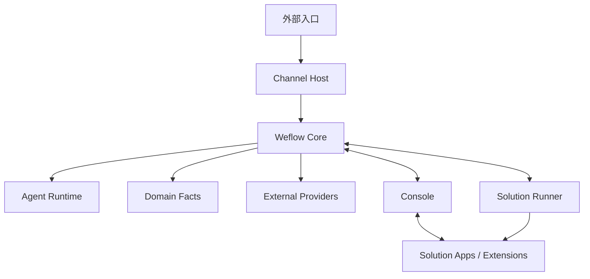

# Repository Convergence

## Decision

Weflow 采用“Core + Apps + Solutions + Contracts”的平台仓库形态。目录按职责命名，不按迁移阶段的编号命名。平台核心负责底座能力，具体业务以 Solution Pack 方式接入。

## Ownership

| Area | Owns | Must not own |
| --- | --- | --- |
| Core | Conversation、Message、Case、Handoff、Memory、Audit、Agent、Skill、Policy | 通道私有实现（数据库、`local_id`、自动化） |
| Channel Host | 入口轮询、可靠事件存储、发送操作、媒体引用解析 | Domain 业务规则、Agent 决策 |
| Console | 配置、知识运营、观察与管理 | Channel 私有实现 |
| Solution Runner | Solution Pack 生命周期操作执行 | 下载、签名、迁移的权威判断 |
| External Provider | TextModel、Vision、ZhiNanKB/WeKnora 等外部能力 | Weflow 的权威业务事实 |

## Formal seams

Core 的 Channel seam 只有四个正式能力：

- `channel.events`：按游标拉取标准化事件；
- `channel.send`：创建和查询幂等出站操作；状态允许 `pending`、`confirmed`、`unknown`、`failed`；
- `channel.media`：按不透明 `mediaRef` 获取媒体；Core 不接触通道私有 ID。
- `channel.contacts`：按不透明 `contactRef` 游标同步标准化联系人资料；通道数据库字段不越过 Host seam。

论文中的 Runtime Module、`requires/provides`、Capability Interface 和 effect 适用于 Core 的运行时组合与资源释放。effect 不能撤销已经发送到通道的外部消息，因此发送确认仍由 Channel Host 的持久化操作和 Core 的对账逻辑负责。

## Migration policy

本阶段只做物理收敛和职责命名，不进行 Core 内部的大规模 package 拆分，不迁移旧机器人源码，不把外部 Provider 内置化。

- 新术语：Core、Channel Host、Console、Solution。
- 历史术语：`Server1`、`Server2`、`Client1`、`Client2`，仅在归档迁移说明中出现。
- Core 的正式依赖方向是 `infrastructure/channel` 的 Channel Host Provider。
- `wechatbot-new` 继续作为独立归档仓库，不复制源码。
