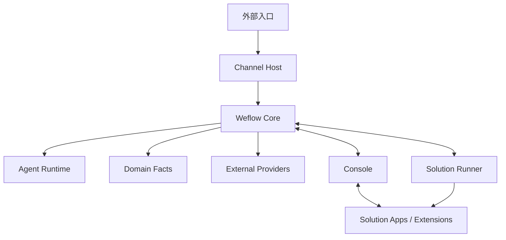

# Weflow 技术文档

> **文档定位**：Weflow 平台唯一的产品技术文档入口，也是 Console「帮助文档 / 技术文档」页的内容源。
> **维护状态**：维护中
> **最近更新**：2026-08-20
> **文档负责人**：Weflow Platform Team
> **评审周期**：每季度一次；架构、接口、默认 Solution 或安装流程变化时随时评审

---

## 1. 文档说明

### 1.1 目的

本文档描述 Weflow 平台的产品形态、系统架构、核心概念、默认能力、扩展机制、运维方式与文档维护方法。目标是让以下角色都能从一份可维护的文档出发：

- 新成员快速理解 Weflow 是什么、由哪些组件组成、如何安装与运维；
- 技术负责人核对架构边界与关键契约；
- 实施/交付人员了解如何接入业务 Solution Pack；
- AI 编码代理在修改代码前快速获取仓库约束与领域语言。

### 1.2 读者

| 读者 | 关注内容 |
| --- | --- |
| 软件工程师 | 架构、核心概念、API 分组、开发命令、文档维护 |
| 技术负责人 | 架构边界、ADR、扩展点、安全模型 |
| DevOps / 运维 | 系统状态、Solution 生命周期、故障排查、发布 |
| 实施/交付 | Solution Pack 安装、默认能力、优秀案例 |
| 新成员 | 产品概述、术语表、快速开始 |

### 1.3 维护方式

- 本文档是 Console 帮助页的**单一内容源**；Console 直接渲染本文件，不再维护另一份帮助文案。
- 修改本文档后必须更新「最近更新」和「版本/变更记录」。
- 单文件建议不超过 500 行。内容继续增长时，应拆分到 `docs/` 子目录，并在本文档对应章节使用链接挂载，Console 帮助页保留摘要与入口。
- 文档中的事实以代码、`core/docs/adr/`、公开契约和实际运行行为为准；发现不一致时优先修文档或代码，不允许两边长期分叉。
- 涉及 Core 的架构决策必须先看 `core/AGENTS.md`、`core/CONTEXT.md` 与 `core/docs/adr/`。

### 1.4 变更记录

| 日期 | 版本 | 变更 |
| --- | --- | --- |
| 2026-08-20 | 1.2 | 客服业务包迁出为独立仓库 Weflow-Solutions（`github.com/liyifu-2026/Weflow-Solutions`）；安装指南补充 Execution Profile 自动落库与压缩包 artifacts 结构 |
| 2026-08-20 | 1.1 | 移除客服业务与微信实现目录（support-web / support-bff / mobile / customer-support / channel-host-wechat / wechatauto）的引用，文档对齐 Platform Core 仓库形态 |
| 2026-08-20 | 1.0 | 创建 Weflow 平台技术文档，替换 Console 旧帮助文档 |

---

## 2. 产品概述

Weflow 是面向企业服务场景的 **AI 员工平台**。它把多入口消息、Agent Runtime、业务事实和人工协作组织成一个可替换、可审计的系统。

产品定位可以概括为：

- **Platform（平台层）**：提供 Core、Console、Contracts、Plugin SDK、Solution SDK、Admin SDK、weflowctl 与 Solution Runner，是独立可发布的产品底座。
- **Ecosystem（生态层）**：通过 Solution Pack 提供具体业务，例如知识库、记忆等。业务包可安装、可签名、可回滚。

Weflow 本身**不内置具体业务**，而是以 Solution Pack 方式接入业务能力。默认随仓库提供的官方基础 Solution 包括客服（`weflow.customer-support`）、知识库（`weflow.knowledge`）与记忆（`weflow.memory`），它们作为平台基础能力安装到 Console。

---

## 3. 系统架构

### 3.1 组件拓扑



### 3.2 组件职责

| 组件 | 职责 | 不负责 |
| --- | --- | --- |
| Core | Conversation、Message、Case、Handoff、Memory、Audit、Agent、Skill、Policy 等业务事实与运行 | 通道私有实现（数据库、`local_id`、自动化） |
| Channel Host | 入口轮询、可靠事件存储、发送操作、媒体引用解析 | Domain 业务规则、Agent 决策 |
| Console | 平台管理、业务方案生命周期、系统状态、用户与角色、审计 | Channel 私有实现、业务事实直接写入 |
| Solution Runner | 执行 Solution Pack 的安装/激活/停用/卸载/回滚操作 | 下载、签名、迁移的权威判断 |
| External Provider | TextModel、Vision、ZhiNanKB/WeKnora 等外部能力 | Weflow 的权威业务事实 |

### 3.3 关键边界与 Seam

Core 与 Channel Host 之间只暴露四个正式 Channel 能力：

- `channel.events`：按游标拉取标准化事件；
- `channel.send`：创建和查询幂等出站操作，状态允许 `pending`、`confirmed`、`unknown`、`failed`；
- `channel.media`：按不透明 `mediaRef` 获取媒体；
- `channel.contacts`：按不透明 `contactRef` 同步标准化联系人资料。

规则：

- Core 不读取通道私有数据库，不依赖通道自动化实现，不理解通道私有 ID（如微信 `local_id`）。
- 通道协议、自动化、源文件解析与 `local_id` 必须留在 Channel Host/适配器内。
- Domain Service 是业务事实的唯一写入口，Agent 不直接写数据库。
- Runtime effect 只负责释放进程内资源；不能把已发出的通道消息当作可撤销 effect。

### 3.4 运行拓扑

| 进程/应用 | 说明 |
| --- | --- |
| Core API | HTTP API 组合根，承载管理端、业务 Solution、Runner 与 Channel Host 的接入 |
| Agent Worker | Agent Turn、Memory、Evaluation 队列消费者 |
| Ingestion Worker | 图片/语音等媒体处理队列消费者 |
| Solution Runner | 独立执行 Solution Pack 生命周期操作 |
| Console | 平台管理 SPA，部署为静态资源 + nginx 反代 `/api` |
| 业务 Solution App | 由业务 Solution Pack 提供的应用（如知识库/记忆的 Console 扩展与后端插件） |
| Channel Host | 通道入口适配层（平台级抽象，具体实现由外部适配器提供） |

---

## 4. 核心概念与领域模型

| 概念 | 说明 | 关键约束 |
| --- | --- | --- |
| Conversation | 与通道无关的标准化消息、处理状态、游标和发送结果集合 | 每个会话串行化 Agent 工作，不同会话可并行 |
| Message | 会话中的一条消息，包含入站、出站、人工消息等 | 出站消息使用稳定 reply batch ID 与 sequence |
| Contact Profile | 人工维护的联系人身份映射、标签、类型、Agent 开关与知识关联 | 不等于登录用户 |
| Agent Turn | 一次触发下由策略判断、上下文组装、模型推理和工具执行组成的编排过程 | 必须绑定策略版本，可恢复、可审计 |
| Case | 需要跟踪的业务处理单元（如一个需要持续跟踪的业务实例） | 使用 `revision` 乐观锁，旧 Turn 只能 `superseded` |
| Handoff | 需要人类接管或处置的业务状态及生命周期 | Conversation 级暂停；创建 Handoff 取消 pending Agent 草稿 |
| Memory | 从跨轮对话提取的长期事实、偏好和关系 | 异步捕获，只召回 active、evidence-backed、非敏感记忆 |
| Knowledge | 经摄入、索引并可追溯检索的外部资料 | 回答必须有可检索、可归因的证据 |
| Media | 以 `mediaId` 引用并由 Core 管理元数据/派生结果的非文本内容 | 不在会话中存 Base64 |
| Audit | 关键操作的审计事实 | 只保存业务事实，不保存密钥 |

更多领域语言见 `core/CONTEXT.md`，架构决策见 `core/docs/adr/`。

---

## 5. 平台组件与默认能力

### 5.1 Console 平台管理

Console 是 Weflow 的管理与运营工作台，当前页面包括：

| 路径 | 页面 | 说明 | 权限 |
| --- | --- | --- | --- |
| `/` | 平台总览 | 已接入方案、运行状态、Dashboard 卡片 | 登录 |
| `/platform/solutions` | 业务方案 | 导入/安装/激活/停用/卸载/回滚 Solution Pack | admin |
| `/system/status` | 系统状态 | Core、Channel Host、运行时、知识服务等健康状态 | 登录 |
| `/system/users` | 用户与角色 | 账号发放、重置密码、禁用、撤销会话 | admin |
| `/system/operations` | 运行 | Agent 总开关、能力开关、运行快照、SSE 实时流 | admin |
| `/system/audit` | 审计日志 | 关键操作审计与筛选 | admin |
| `/settings` | 统一设置 | 平台设置与已安装业务包的设置贡献项 | admin |
| `/help` | 帮助/技术文档 | 渲染 `docs/technical-documentation.md` | 登录 |

Console 是平台宿主，不拥有具体业务。业务包通过 `consoleExtensions` 动态声明侧栏、设置、Dashboard 卡片与 API 路由。

### 5.2 Core API 概览

Core 提供 HTTP API，按模块分组：

| 分组 | 主要路径 | 说明 |
| --- | --- | --- |
| 认证与用户 | `/api/v1/auth/*`、`/api/v1/admin/users*`（含 `/api/v1/mobile/auth/*` 兼容路由） | 登录、会话、改密、用户管理 |
| 会话 | `/api/v1/conversations*` | 会话列表、详情、消息、搜索 |
| 人工接管 | `/api/v1/handoff-*`（含 `/api/v1/mobile/handoffs/*` 兼容路由） | Handoff 收件箱、领取、转交、处理 |
| Agent | `/api/v1/agent/*` | 策略、执行摘要 |
| 知识 | `/api/v1/knowledge/*`、`/api/v1/admin/knowledge-*` | 检索、知识库、模型/向量库/存储治理 |
| 记忆 | `/api/v1/memory/*` | 记忆读写与捕获状态 |
| 媒体 | `/api/v1/media/*` | 媒体元数据与内容 |
| Solution | `/api/v1/admin/solutions*`、`/api/v1/runner/*` | 方案安装/生命周期/Runner 操作 |
| 运维 | `/api/v1/admin/*`、`/api/v1/system/status` | 总览、运行、审计、系统状态 |
| 事件 | `/api/v1/console/events/stream` | Console SSE 实时事件流 |

完整路由以 Core 源码 `core/modules/*/interface/http-routes.ts` 为准。API 文档应始终以代码/OpenAPI 契约为准，本文件只做导航。

### 5.3 官方基础 Solution：客服（`weflow.customer-support`）

客服是 Weflow 官方提供的基础 Solution Pack，承载人工交接领域服务，避免业务逻辑内聚在 Core。

- **定位**：平台默认基础能力，不属于外部业务。
- **主要能力**：人工交接 accept/take-over/transfer/resolve、交接状态查询、今日咨询量/待处理会话统计。
- **Console 入口**：安装激活后通过 `consoleExtensions` 提供客服方案设置项与 Dashboard 卡片；不再嵌入独立 Support Web。
- **典型接口**：`/customer-support/status`、`/customer-support/handoffs`、`/customer-support/handoffs/:conversationId/accept`、`/take-over`、`/transfer`、`/resolve`。
- **边界**：客服业务包只提供业务能力，不包含通道私有实现；通道事实仍由 Channel Host 负责。

### 5.4 官方基础 Solution：知识库（`weflow.knowledge`）

知识库是 Weflow 官方提供的基础 Solution Pack，用于接入外部知识 Provider（如 ZhiNanKB/WeKnora）并沉淀可追溯的检索证据。

- **定位**：平台默认基础能力，不属于外部业务。
- **主要能力**：知识检索、检索记录、知识库/线程查询、状态统计。
- **Console 入口**：安装激活后通过 `consoleExtensions` 提供「知识库」业务入口、设置项与 Dashboard 卡片。
- **典型接口**：`/knowledge/status`、`/knowledge/retrievals`、`/knowledge/threads`、`/knowledge/bases`、`/knowledge/search`。
- **边界**：ZhiNanKB/WeKnora 是外部 Provider，不复制进本仓库；Core 只调用 scoped 检索 API。

### 5.5 官方基础 Solution：记忆（`weflow.memory`）

记忆是 Weflow 官方提供的基础 Solution Pack，用于从跨轮对话中提取长期客户事实。

- **定位**：平台默认基础能力，不属于外部业务。
- **主要能力**：记忆写入/查询、捕获状态、统计。
- **Console 入口**：安装激活后提供「记忆库」业务入口、设置项与 Dashboard 卡片。
- **典型接口**：`/memory/status`、`/memory/memories`、`/memory/capture-states`。
- **边界**：Memory 只保存长期事实，不保存完整聊天记录。

### 5.6 平台 SDK 与工具

| 包/工具 | 说明 |
| --- | --- |
| `@weflow/contracts` | 稳定公共契约 |
| `@weflow/plugin-sdk` | Plugin 注册契约：Tool / Skill / Execution Strategy / Provider |
| `@weflow/solution-sdk` | npm 风格 Solution 包契约：Manifest/Lock/Signature 校验与签名验证 |
| `@weflow/admin-sdk` | Core Admin 客户端 |
| `@weflow/ui` | 共享 UI 工具 |
| `weflowctl` | CLI：Solution 校验、状态、激活、停用、卸载、回滚、Secret 管理 |

---

## 6. 插件与 Solution Pack

### 6.1 Plugin 类型

Plugin 是通过公开 SDK 在 Platform seam 上扩展能力的包，类型包括：

| 类型 | 说明 |
| --- | --- |
| Provider | 接入外部能力（模型、视觉、知识等） |
| Tool | 提供可被 Agent 调用的工具 |
| Skill | 提供领域技能逻辑 |
| Execution Strategy | 决定 Agent 如何构建模型请求、解析响应并校验动作 |
| Solution App | Solution Pack 内独立构建/部署的应用 |

外部 Plugin 只能使用公开 exports，不能深层导入 Core 源码。

### 6.2 Solution Pack 结构

一个 Solution Pack 是可安装、可签名、可回滚的业务方案发布单元：

```text
knowledge.zip
├── solution.manifest.json   # 方案声明：ID、版本、能力、Secret、前端入口、扩展点
├── solution.lock.json       # artifact 清单与摘要
├── signature.json           # Ed25519 签名（生产环境必须）
└── backend/                 # 可选后端插件模块
```

Manifest 中的关键字段：

- `metadata.id`：方案唯一 ID，如 `weflow.knowledge`
- `compatibility`：平台版本与 Plugin SDK 兼容范围
- `artifacts`：插件/应用/资源清单与 digest
- `secretSlots`：声明的 Secret 槽位（只保存引用，不保存明文）
- `executionProfiles`：Agent 执行配置（策略、模型调用上限、允许工具、Skill）
- `consoleExtensions`：Console 侧栏、设置、Dashboard、API 路由、事件订阅
- `backend.entry`：可选后端插件模块，Core 动态加载并注册路由

### 6.3 安装与生命周期

安装流程：

1. 在 Console「业务方案」页上传 ZIP 或粘贴 Manifest/Lock/Signature；
2. Core 创建安装 Operation；
3. Solution Runner 领取 Operation 并执行；
4. 方案状态变为「已安装」；
5. 管理员「激活」方案，状态变为「已激活」；
6. 激活后 Console 动态加载业务扩展入口。

生命周期状态：

- Desired State：`disabled` / `active` / `removed`
- Observed State：`absent` / `installing` / `installed` / `configured` / `activating` / `active` / `degraded` / `rolling_back` / `uninstalling` / `removed` / `failed`

CLI 管理示例：

```bash
node tooling/weflowctl/dist/cli.js solution status <solution-id> \
  --core-url http://127.0.0.1:3100 --admin-token <token>
node tooling/weflowctl/dist/cli.js solution activate <solution-id> \
  --core-url http://127.0.0.1:3100 --admin-token <token>
node tooling/weflowctl/dist/cli.js solution rollback <solution-id> \
  --core-url http://127.0.0.1:3100 --admin-token <token>
```

### 6.4 Console 扩展点

| 扩展点 | 说明 | 现状 |
| --- | --- | --- |
| `nav` | 侧栏导航项 | ✅ 已有 |
| `settings` | 设置项，按分类融合进设置页 | ✅ 已有入口/贡献项 |
| `dashboard` | 总览卡片 | ✅ 已泛化 |
| `api` | 业务包 API 路由注册与统一代理 | ✅ 已支持 `apiRoutes` |
| `events` | 平台事件订阅 | ✅ 已支持 `eventSubscriptions` |

详见 `docs/extension-points.md`。

### 6.5 安全边界

- 生产安装只接受受信发布者、Ed25519 有效签名、allowlist registry、固定 digest 与完整 lock。
- Manifest 不允许 Shell 安装命令、Core migration、Core 表写入、任意 Console JavaScript/iframe/远程 Vue Module、Secret 明文、未声明权限或未实现组件类型。
- Secret v1 只支持 `env SecretRef` 与 `file SecretRef`；Core 只保存引用和“已配置/缺失”状态。
- 卸载只停止未来运行、移除组合关系并归档方案资源；历史 Conversation、Message、AgentTurn、Handoff、Audit 与 provenance 永久保留。

---

## 7. 运维指南

### 7.1 环境要求

- Node.js：根仓库推荐 24，Console 要求 >=20.19 <25
- PostgreSQL：Core 的唯一业务事实源
- Redis/BullMQ：可恢复的投递提示，必须可从 PostgreSQL 重建
- Solution Runner：需要 `CORE_API_URL`、`RUNNER_TOKEN`、`SOLUTION_STAGING_ROOT`；开发环境可设 `SOLUTION_DEV_UNSIGNED=1`

### 7.2 系统状态与健康

Console「系统状态」页展示平台基础设施健康：

- Weflow Core
- 通道（Channel Host）
- 模型运行时
- 知识服务

配置状态与健康状态分开显示；未配置的服务不会伪装成健康。

### 7.3 Solution 运维

```bash
# 查看方案状态
node tooling/weflowctl/dist/cli.js solution status <solution-id> \
  --core-url http://127.0.0.1:3100 --admin-token <token>

# 查看操作日志
node tooling/weflowctl/dist/cli.js solution logs <operation-id> \
  --core-url http://127.0.0.1:3100 --admin-token <token>

# Secret 配置状态（只读引用）
node tooling/weflowctl/dist/cli.js solution secrets <solution-id> \
  --core-url http://127.0.0.1:3100 --admin-token <token>
```

### 7.4 故障排查

| 现象 | 检查点 |
| --- | --- |
| 导入 zip 后没有反应 | ZIP 根目录是否包含 Manifest/Lock/Signature；Runner 是否运行 |
| 安装后一直是「安装中」 | Solution Runner 是否运行；`SOLUTION_STAGING_ROOT` 是否可写 |
| 系统状态显示「未配置」 | 对应外部服务是否已在 Core 启动环境配置凭据/地址 |
| Agent 不回复 | Agent 总开关、执行策略（Execution Profile）是否 active；是否有 Handoff 阻塞 |
| 知识检索失败 | Knowledge Solution 是否激活；外部 Provider 是否配置；是否有可检索 evidence |

---

## 8. 安全与合规

- 文档、配置、示例中**禁止出现**凭据、API Key、Token、密码、私钥。一律使用 `<YOUR_API_KEY>`、`$DATABASE_URL`、`<REDACTED>` 占位。
- 公开/共享文档中**禁止出现**内网 IP（`10.x.x.x`、`192.168.x.x`）、内部主机名与 VPN 端点。
- Runbook/运维文档中的破坏性命令必须带 ⚠️ 警告，说明影响范围与验证目标环境的方法。
- Agent-facing 文档（AGENTS.md/CLAUDE.md 等）不得包含绕过安全策略、窃取数据或忽略防护的指令。
- 文档声称“完整/已审计”之前，必须实际执行完整性与新鲜度审计。

---

## 9. 开发与贡献

### 9.1 仓库形态

```text
weflow/
├─ core/                         # Weflow Core
├─ packages/                     # contracts / plugin-sdk / solution-sdk / admin-sdk / ui
├─ apps/                         # console / solution-runner
├─ solutions/                    # 官方 Solution Pack（knowledge / memory）
├─ contracts/channel/            # 跨进程 Channel 协议说明
├─ docs/                         # 平台文档（本文档与专题文档）
└─ tooling/weflowctl/            # CLI
```

### 9.2 验证命令

```bash
# 根目录统一安装
pnpm install:all

# 平台验证（Core + Console + SDK + weflowctl + Solution Runner）
pnpm platform:verify

# Solution 校验（knowledge / memory）
pnpm solution:verify

# Console 单独校验
pnpm --dir apps/console check
```

### 9.3 文档维护检查

修改 `docs/technical-documentation.md` 后，至少：

1. 更新「最近更新」与「变更记录」；
2. 检查文中链接是否有效；
3. 检查是否包含明文 Secret/内网 IP；
4. 运行 `pnpm --dir apps/console check`，确保 Console 帮助页可构建；
5. 如内容超过 500 行，拆分子文档并在本文档建立索引。

---

## 10. 文档维护清单

- [ ] 每季度评审一次本文档，更新已过时内容
- [ ] 每次架构/API/Solution 默认能力变化时更新对应章节
- [ ] Console 帮助页直接渲染本文档，禁止在 Console 源码中复制一份帮助文案
- [ ] 新成员入职后按本文档走通一次安装/运维流程，反馈修正
- [ ] 每次 Release 前检查文档中的命令、路径、版本号是否仍然正确

---

## 附录 A：术语表

| 术语 | 含义 |
| --- | --- |
| Core | Weflow 无界面业务核心，拥有除通道原始事实外的全部业务事实 |
| Channel Host | 通道入口适配层，负责连接外部入口、感知消息、执行发送与媒体解析 |
| Console | 平台管理 SPA |
| Solution Pack | 可安装、可签名、可回滚的业务方案发布单元 |
| Plugin | 通过公开 SDK 扩展 Platform 能力的包 |
| Execution Strategy | 决定 Agent 如何构建/解析模型请求与动作的策略插件 |
| Handoff | 需要人类接管或处置的业务状态 |
| Memory | 从跨轮对话提取的长期事实 |
| Knowledge | 经摄入、索引并可追溯检索的外部资料 |

## 附录 B：相关文档

| 文档 | 说明 |
| --- | --- |
| [README.md](../README.md) | 仓库总览与开发命令 |
| [core/CONTEXT.md](../core/CONTEXT.md) | Core 领域语言 |
| [core/AGENTS.md](../core/AGENTS.md) | Core 工程约束 |
| [core/docs/adr/](../core/docs/adr/) | 已接受架构决策 |
| [docs/architecture/repository-convergence.md](architecture/repository-convergence.md) | 仓库收敛说明 |
| [docs/extension-points.md](extension-points.md) | Console 扩展点架构 |
| [docs/solution-install.md](solution-install.md) | Solution Pack 安装指南 |
| [docs/console-ux-optimization.md](console-ux-optimization.md) | Console UX 优化记录（历史） |
