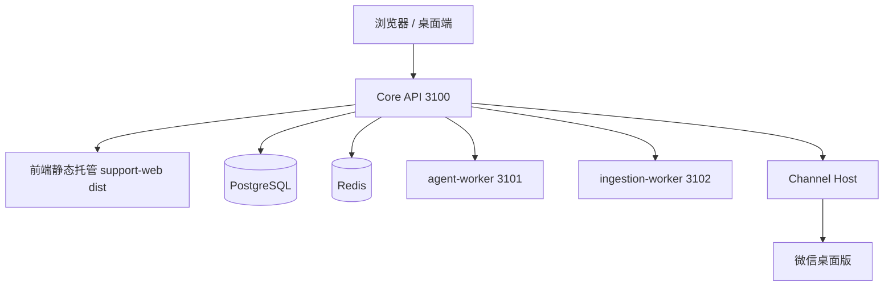

# Weflow 技术文档

> **文档定位**：Weflow 产品技术文档入口（Console「帮助文档 / 技术文档」页的内容源）。
> **维护状态**：维护中
> **最近更新**：2026-09-04
> **文档负责人**：Weflow Platform Team
> **评审周期**：每季度一次；架构、接口或部署形态变化时随时评审

---

## 1. 文档说明

### 1.1 目的

本文档描述 Weflow 的产品形态、系统架构、核心概念、扩展机制与运维方式。目标是让以下角色都能从一份可维护的文档出发：

- 新成员快速理解 Weflow 是什么、由哪些组件组成、如何部署与运维；
- 技术负责人核对架构边界与关键契约；
- AI 编码代理在修改代码前快速获取仓库约束与领域语言。

### 1.2 读者

| 读者 | 关注内容 |
| --- | --- |
| 软件工程师 | 架构、核心概念、API 分组、开发命令、文档维护 |
| 技术负责人 | 架构边界、ADR、扩展点、安全模型 |
| DevOps / 运维 | 部署、系统状态、热更新、故障排查、发布 |
| 新成员 | 产品概述、术语表、快速开始 |

### 1.3 维护方式

- 本文档是 Console 帮助页的**单一内容源**；Console 直接渲染本文件，不再维护另一份帮助文案。
- 修改本文档后必须更新「最近更新」和「变更记录」。
- 单文件建议不超过 500 行。内容继续增长时，应拆分到 `docs/` 子目录，并在本文档对应章节使用链接挂载。
- 文档中的事实以代码、`core/docs/adr/`、公开契约和实际运行行为为准；发现不一致时优先修文档或代码，不允许两边长期分叉。
- 涉及 Core 的架构决策必须先看 `core/AGENTS.md`、`core/CONTEXT.md` 与 `core/docs/adr/`。

### 1.4 变更记录

| 日期 | 版本 | 变更 |
| --- | --- | --- |
| 2026-09-04 | 2.0 | R4 部署形态重写：删除 Solution Pack / Runner / Console 扩展点内容；部署收敛为三进程 Windows 服务 + 前端静态托管；新增热更新规程与桌面端说明 |
| 2026-08-20 | 1.2 | 客服业务包迁出为独立仓库 Weflow-Solutions |
| 2026-08-20 | 1.1 | 移除客服业务与微信实现目录的引用，文档对齐 Platform Core 仓库形态 |
| 2026-08-20 | 1.0 | 创建 Weflow 平台技术文档 |

---

## 2. 产品概述

Weflow 是一个「**单进程部署、配置集中、可高效热更新的 AI 客服产品**」。它把多入口消息、Agent Runtime、业务事实和人工协作组织成一个可审计、可热更新的系统。

- **平台层（`weflow` 仓库）**：Core（认证、会话/消息/Handoff 等领域事实、系统管理、审计、设置）、Contracts、Plugin SDK、weflowctl。
- **业务层（`weflow-solutions` 仓库）**：产品网页端 support-web、业务插件（Skill / Execution Strategy）、业务 BFF。

没有方案市场，没有微前端，没有 Console 业务页面。产品网页端只有 support-web（自带登录 + 应用布局），部署时由 api 进程静态托管。

---

## 3. 系统架构

### 3.1 组件拓扑



### 3.2 组件职责

| 组件 | 职责 | 不负责 |
| --- | --- | --- |
| Core API | 全部 HTTP API、前端静态托管、后台调度器（通道轮询/推送/记忆/合并窗口） | 通道私有实现（数据库、`local_id`、自动化）、模型推理执行 |
| agent-worker | Agent Turn 执行：策略判断、上下文组装、模型推理、工具调用 | 直接写数据库（经 Domain Service） |
| ingestion-worker | 媒体转码、视觉描述、语音转写 | 同上 |
| Channel Host | 入口轮询、可靠事件存储、发送操作、媒体引用解析 | Domain 业务规则、Agent 决策 |
| External Provider | TextModel、Vision、WeKnora 等外部能力 | Weflow 的权威业务事实 |

### 3.3 关键边界与 Seam

Core 与 Channel Host 之间只暴露四个正式 Channel 能力：

- `channel.events`：按游标拉取标准化事件；
- `channel.send`：创建和查询幂等出站操作，状态允许 `pending`、`confirmed`、`unknown`、`failed`；
- `channel.media`：按不透明 `mediaRef` 获取媒体；
- `channel.contacts`：按不透明 `contactRef` 同步标准化联系人资料。

规则：

- Core 不读取通道私有数据库，不依赖通道自动化实现，不理解通道私有 ID（如微信 `local_id`）。
- 通道协议、自动化、源文件解析与 `local_id` 必须留在 Channel Host/适配器内。
- Domain Service 是业务事实的唯一写入口，Agent 不直接写数据库。
- Runtime effect 只负责释放进程内资源；不能把已发出的通道消息当作可撤销 effect。

### 3.4 运行拓扑（生产）

| 进程 | 形态 | 说明 |
| --- | --- | --- |
| Core API | Windows 服务 `weflow-core-api` | HTTP API + 前端托管，热更新时**不重启** |
| agent-worker | Windows 服务 `weflow-agent-worker` | Agent Turn 消费者，热更新时滚动重启 |
| ingestion-worker | Windows 服务 `weflow-ingestion-worker` | 媒体处理消费者，热更新时滚动重启 |
| Channel Host | 登录用户会话进程 | 与微信桌面同机；不可服务化 |

部署与热更新规程见 `docs/deployment-guide.md`。

---

## 4. 核心概念与领域模型

| 概念 | 说明 | 关键约束 |
| --- | --- | --- |
| Conversation | 与通道无关的标准化消息、处理状态、游标和发送结果集合 | 每个会话串行化 Agent 工作，不同会话可并行 |
| Message | 会话中的一条消息，包含入站、出站、人工消息等 | 出站消息使用稳定 reply batch ID 与 sequence |
| Contact Profile | 人工维护的联系人身份映射、标签、类型、Agent 开关与知识关联 | 不等于登录用户 |
| Agent Turn | 一次触发下由策略判断、上下文组装、模型推理和工具执行组成的编排过程 | 必须绑定策略版本，可恢复、可审计 |
| Case | 需要跟踪的业务处理单元 | 使用 `revision` 乐观锁，旧 Turn 只能 `superseded` |
| Handoff | 需要人类接管或处置的业务状态及生命周期 | Conversation 级暂停；创建 Handoff 取消 pending Agent 草稿 |
| Memory | 从跨轮对话提取的长期事实、偏好和关系 | 异步捕获，只召回 active、evidence-backed、非敏感记忆 |
| Knowledge | 经摄入、索引并可追溯检索的外部资料 | 回答必须有可检索、可归因的证据 |
| Media | 以 `mediaId` 引用并由 Core 管理元数据/派生结果的非文本内容 | 不在会话中存 Base64 |
| Audit | 关键操作的审计事实 | 只保存业务事实，不保存密钥 |

更多领域语言见 `core/CONTEXT.md`，架构决策见 `core/docs/adr/`。

---

## 5. 平台组件与默认能力

### 5.1 产品网页端（support-web）

产品唯一网页端是 `weflow-solutions/solutions/customer-support/apps/support-web`（自带登录 + 应用布局 + browser history 真实路径）。主要路由：

| 路径 | 说明 |
| --- | --- |
| `/login`、`/change-password` | 登录 / 改密 |
| `/conversations` | 会话工作台（含 Handoff 处置） |
| `/knowledge`、`/assets` | 知识库 / 素材空间 |
| `/ai-employees` | AI 员工配置（人格/分工/能力/节奏） |
| `/settings` | 设置中心（七分区） |
| `/system/status`、`/system/users`、`/system/audit` | 系统状态、用户、审计 |
| `/profile` | 个人资料 |

`apps/console` 已退役（仅保留平台级页面的维护），不再承载任何业务 UI。

### 5.2 Core API 概览

| 分组 | 主要路径 | 说明 |
| --- | --- | --- |
| 认证与用户 | `/api/v1/auth/*`、`/api/v1/admin/users*`（含 `/api/v1/mobile/auth/*` 兼容路由） | 登录、会话、改密、用户管理 |
| 会话 | `/api/v1/conversations*` | 会话列表、详情、消息、搜索 |
| 人工接管 | `/api/v1/handoff-*`（含 `/api/v1/mobile/handoffs/*` 兼容路由） | Handoff 收件箱、领取、转交、处理 |
| 协作 | `/api/v1/collaboration-requests/*` | 协作请求 |
| Agent | `/api/v1/agent/*` | 策略、执行摘要 |
| 知识 | `/api/v1/knowledge/*`、`/api/v1/admin/knowledge-*` | 检索、知识库连接器、治理 |
| 记忆 | `/api/v1/memory/*` | 记忆读写与捕获状态 |
| 媒体 | `/api/v1/media/*` | 媒体元数据与内容 |
| 设置 | `/api/v1/admin/solutions/:solutionId/extensions/:extensionId/settings` | 通用 JSON 设置存储 |
| 运维 | `/api/v1/admin/*`、`/api/v1/system/status` | 运行、审计、系统状态 |
| 事件 | `/api/v1/console/events/stream` | SSE 实时事件流 |

完整路由以 Core 源码 `core/modules/*/interface/http-routes.ts` 为准。

### 5.3 业务插件（weflow-solutions）

业务能力通过**插件目录直读**加载（R3 后唯一插件机制）：Core 从 `WEFLOW_PLUGIN_DIR` 指向的目录直读

- `backend/index.js`（或 `backend/<key>/index.js`）：BFF 路由，`registerRoutes(server, ctx)` 契约；
- `plugins/*/dist`：Skill / Execution Strategy，由 Agent Worker 加载。

没有打包、安装、签名、激活、回滚流程；改插件 → 构建产物 → 重启 worker 即生效。

### 5.4 SDK 与工具

| 包/工具 | 说明 |
| --- | --- |
| `@weflow-leaif/contracts` | 稳定公共契约（Channel 协议、AgentAction 等） |
| `@weflow-leaif/plugin-sdk` | Plugin 注册契约：Tool / Skill / Execution Strategy |
| `weflowctl` | CLI：dev（doctor/up/down）、service（Windows 服务管理）、config、completion |

---

## 6. 部署与热更新

生产部署形态：三进程 Windows 服务 + PostgreSQL + Redis，前端由 api 静态托管，Channel Host 与微信同机。

- 完整部署步骤（从零拉起到登录收发）：`docs/deployment-guide.md`
- 热更新规程（前端整包替换秒级生效 / worker 滚动重启 / api 零中断 / 回退与快照）：`docs/deployment-guide.md` 第 12 节
- 桌面端（Tauri 壳）：`weflow/apps/desktop`

---

## 7. 运维指南

### 7.1 环境要求

- Node.js >=24 <25、pnpm >=10
- PostgreSQL：Core 的唯一业务事实源
- Redis/BullMQ：可恢复的投递提示，必须可从 PostgreSQL 重建

### 7.2 系统状态与健康

- `/health/live`：进程存活探针
- `/health/ready`：依赖就绪探针（Postgres / Redis），503 = 依赖异常
- support-web「系统状态」页展示 Core、通道、模型运行时、知识服务的配置状态与健康状态；未配置的服务不会伪装成健康。

### 7.3 故障排查

| 现象 | 检查点 |
| --- | --- |
| 服务启动后立即停止 | `tools/winsw/logs/*.err.log`；端口被 dev 进程占用 / `.env` 缺键 / dist 未构建 |
| Agent 不回复 | Agent 总开关、执行策略是否启用；是否有 Handoff 阻塞；`MODEL_API_KEY` 是否配置 |
| 知识检索失败 | 知识库连接器配置；外部 Provider 是否可达 |
| 登录后仍提示登录 | `SESSION_COOKIE_SECURE` 与实际协议不匹配 |

更多见 `docs/deployment-guide.md` 排障速查。

---

## 8. 安全与合规

- 文档、配置、示例中**禁止出现**凭据、API Key、Token、密码、私钥。一律使用 `<YOUR_API_KEY>`、`$DATABASE_URL`、`<REDACTED>` 占位。
- 公开/共享文档中**禁止出现**内网 IP、内部主机名与 VPN 端点。
- Runbook/运维文档中的破坏性命令必须带 ⚠️ 警告，说明影响范围与验证目标环境的方法。
- Agent-facing 文档（AGENTS.md/CLAUDE.md 等）不得包含绕过安全策略、窃取数据或忽略防护的指令。
- 文档声称"完整/已审计"之前，必须实际执行完整性与新鲜度审计。

---

## 9. 开发与贡献

### 9.1 仓库形态

```text
weflow/
├─ core/                         # Weflow Core（api / agent-worker / ingestion-worker）
├─ packages/                     # contracts / plugin-sdk / admin-sdk / ui
├─ apps/                         # desktop（Tauri 壳）；console 已退役
├─ runtimes/channel-host-wechat/ # 微信通道参考实现
├─ docs/                         # 平台文档
├─ tooling/weflowctl/            # CLI（dev / service / config / completion）
└─ tooling/tools/winsw/          # Windows 服务包装（运行时生成）

weflow-solutions/
└─ solutions/customer-support/   # 产品业务：support-web / plugins / backend
```

### 9.2 验证命令

```bash
# Core：格式 / lint / 类型 / 测试
cd weflow/core && pnpm check

# 前端
cd weflow-solutions/solutions/customer-support/apps/support-web && pnpm build

# weflowctl
cd weflow/tooling/weflowctl && pnpm build && pnpm test
```

### 9.3 文档维护检查

修改本文档后，至少：

1. 更新「最近更新」与「变更记录」；
2. 检查文中链接是否有效；
3. 检查是否包含明文 Secret/内网 IP；
4. 内容超过 500 行时拆分子文档并在本文档建立索引。

---

## 10. 文档维护清单

- [ ] 每季度评审一次本文档，更新已过时内容
- [ ] 每次架构/API/部署形态变化时更新对应章节
- [ ] Console 帮助页直接渲染本文档，禁止在 Console 源码中复制一份帮助文案
- [ ] 新成员入职后按 `docs/deployment-guide.md` 走通一次部署/热更新流程，反馈修正
- [ ] 每次 Release 前检查文档中的命令、路径、版本号是否仍然正确

---

## 附录 A：术语表

| 术语 | 含义 |
| --- | --- |
| Core | Weflow 平台核心，拥有除通道原始事实外的全部业务事实 |
| Channel Host | 通道入口适配层，负责连接外部入口、感知消息、执行发送与媒体解析 |
| support-web | 产品唯一网页端（业务仓库内），由 Core API 静态托管 |
| Plugin | 通过目录直读扩展 Core 能力的包（Skill / Execution Strategy / BFF） |
| Execution Strategy | 决定 Agent 如何构建/解析模型请求与动作的策略插件 |
| Handoff | 需要人类接管或处置的业务状态 |
| Memory | 从跨轮对话提取的长期事实 |
| Knowledge | 经摄入、索引并可追溯检索的外部资料 |

## 附录 B：相关文档

| 文档 | 说明 |
| --- | --- |
| [README.md](../README.md) | 仓库总览与开发命令 |
| [core/CONTEXT.md](../core/CONTEXT.md) | Core 领域语言 |
| [core/AGENTS.md](../core/AGENTS.md) | Core 工程约束 |
| [core/docs/adr/](../core/docs/adr/) | 已接受架构决策 |
| [docs/deployment-guide.md](deployment-guide.md) | 部署与热更新规程 |
| [docs/voice-dependency-setup.md](voice-dependency-setup.md) | 语音依赖安装 |
