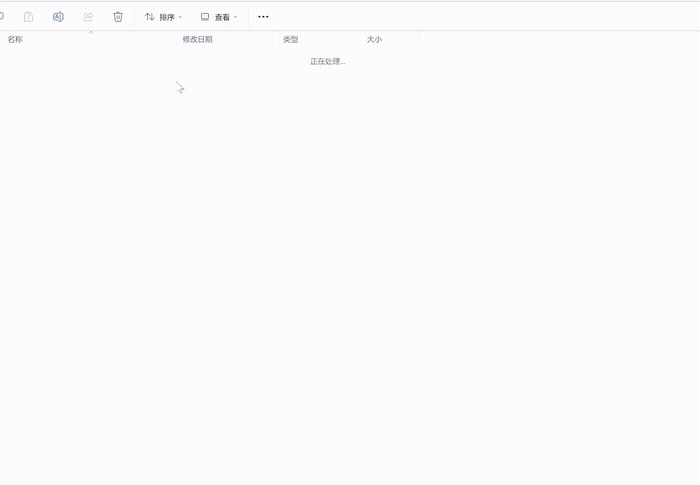

[**English**](README.md) | [**中文**](README.zh-CN.md)

# wechatauto-replica — WeChat 4.x Windows Automation (wxauto-compatible)


Automate the **WeChat 4.x Windows desktop client** (not the web version): read messages, listen in real time, download media, export full history, read Moments (朋友圈), and send messages — by driving the local client directly.

> **Current version:** 1.1.1 · Windows 10/11 · Python 3.9+ (verified on 3.12) · WeChat **4.1.12+**
>
> **Why this project exists:** the classic [wxauto](https://github.com/cluic/wxauto) relies on the UI Automation tree, which WeChat 4.x broke with self-drawn rendering (no accessibility nodes). wechatauto-replica is a drop-in-style replacement: messages are read through **local database decryption** (SQLCipher 4), and sending uses a **UIA + OCR hybrid** driver that auto-falls back between engines.



*Reading the encrypted `contact.db` / `message_*.db` / `sns.db` files directly from `xwechat_files/.../db_storage/` — no web API, all local.*

## ✨ Features

| Capability | Status | How |
|---|---|---|
| Read messages | ✅ verified | Local SQLCipher 4 DB decryption (`wechatauto/db.py`) |
| Real-time message listening | ✅ verified | `Listener` incremental polling, per-chat worker threads |
| Emoji message capture | ✅ verified | Screen capture + direction-aware bubble auto-cropping |
| Full history export | ✅ verified | JSON / SQLite |
| Media download (image / voice / file) | ✅ verified | `MediaDownloader`: image v2 AES decryption, SILK voice, files |
| Moments (朋友圈) read | ✅ verified | Direct `sns.db` reads (3382 feeds verified) |
| Multi-account | ✅ verified | `list_accounts()` + `account=` |
| Send text / file / image / reply / @member | ✅ verified | UIA-first, coordinate + OCR fallback |
| Voice call / Poke (拍一拍) | ✅ verified | UIA buttons + OCR menus |
| UIAutomation tree | ✅ after hot-activation | Writes the Qt accessibility gate inside Weixin.dll |

## 🚀 Quick Start

```bash
pip install -e .
# extra deps for the OCR sending path:
pip install winsdk pypinyin
```

### Read messages

```python
from wechatauto import WeChatDB

db = WeChatDB()  # auto-detects account & data dir (WeChat must be logged in)

info = db.get_self_info()                    # current account
for s in db.get_sessions(limit=10):          # session list
    print(db.get_nickname(s["username"]), s["unread"])

hits = db.search_contact("Ayi")              # search contacts
for m in db.get_messages("filehelper", limit=10):   # recent messages
    print(m["create_time"], m["sender_id"], m["type"], m["content"])
```

### Send a message

```python
from wechatauto.guia import quick_send, quick_send_file

quick_send("Hello", "filehelper", verify=True)   # verify=True reads back from DB
quick_send_file(r"D:\report.pdf", "filehelper")
```

### Real-time listening

```python
from wechatauto import WeChatDB
from wechatauto.db import Listener

db = WeChatDB()
lst = Listener(db, interval=1.0)
lst.add_listener("filehelper", lambda msg, lst: print("new:", msg["content"]))
lst.start()
# ... your code ...
lst.stop()
```

Callbacks run on dedicated per-chat worker threads: messages in one chat are processed in order, different chats in parallel; slow callbacks (AI calls, image recognition) never block the poller.

### Media & Moments

```python
from wechatauto import WeChatDB, MediaDownloader, MomentDB

db = WeChatDB()
md = MediaDownloader(db)
md.detect_image_key()          # scan process memory for the image AES key (persisted after first hit)
for m in db.get_messages("filehelper", limit=50):
    out = md.download_media("filehelper", m["local_id"])
    if out:
        print("downloaded:", out)

moments = MomentDB(db)
for feed in moments.get_moments(limit=10):
    print(feed["nickname"], feed["text"])
    print("  images:", [i["md5"] for i in feed["images"]])
    print("  likes:", [l["nickname"] for l in feed["likes"]])
    print("  comments:", [(c["nickname"], c["content"]) for c in feed["comments"]])
```

## 🧠 How It Works

- **Reading** — WeChat 4.x stores everything in SQLCipher 4 encrypted SQLite databases under `xwechat_files/<wxid>/db_storage/` (`contact.db`, `message_*.db`, `media_0.db`, `sns.db`, …). Each DB has its own 32-byte key living in the Weixin.exe process memory (`com.Tencent.WCDB.Config.Cipher` config objects). The library locates them with a **read-only memory scan**, validates candidates with SQLCipher HMAC rules, decrypts pages to a temp dir and caches the result (first decrypt ~6s, then instant). WAL incremental merging with frame-salt filtering prevents `database disk image is malformed` corruption.
- **Sending** — WeChat 4.x chat UI is self-drawn (no accessibility nodes), so sending uses a hybrid driver: hot-activate the **Qt accessibility gate** inside Weixin.dll (RVA scan, writes the screen-reader flag) to materialize the `mmui::*` UIA tree — search box, `chat_input_field`, etc. Sending is **UIA-first, coordinate + OCR fallback**: auto-calibrating layout (`~/.wechatauto/layout-<machine>.json`), zoomed OCR (3x) with multi-round voting for rare Chinese characters, clipboard + Ctrl+V input to dodge IME interception.
- **Media** — image `.dat` files are `[6B sig][4B aes_size][4B xor_size] + AES-ECB + plaintext + xor` chunks. The account-level AES key is transient (only resident in memory while viewing an image); `MediaDownloader` scans for it, validates via JPEG/PNG magic, and **persists it to `image_keys.json`** so later runs need no scanning (or pass `image_key=` explicitly). Voice is plain SILK read from `media_0.db`; files are read from `msg/file/` with original names resolved from `message_resource.db`.

## ⚖️ vs wxauto

| | wxauto | wechatauto-replica |
|---|---|---|
| WeChat 4.x | ❌ UIA tree gone → broken | ✅ DB decryption + UIA hot-activation |
| Message reading | via UI tree | via local DB (full history, faster) |
| Sending | UIA clicks | UIA-first + OCR fallback |
| Media | limited | image AES decrypt, SILK voice, files |
| Moments | read | read (posting dropped: self-drawn UI) |

## ⚠️ Known Limitations

1. **WeChat must be logged in** — DB keys live in process memory; cached after first extraction, re-extracted automatically after re-login.
2. **Image AES key is transient** — only resident while viewing an image; persisted to `image_keys.json` once found, or inject via `image_key=`.
3. **Sending is a GUI operation** — fails cleanly when the desktop is locked (`desktop_available()` returns False).
4. **Videos** are downloadable only when the mp4 already exists on disk (`msg/video/`).
5. **Moments posting is dropped** (4.x self-drawn UI, unreliable); reading/likes/comments are supported.

## 🗺️ Roadmap

- Calibrate and verify file/image/reply/@ sending on unlocked desktops
- Video message download (4.x storage location TBD)
- Performance: parallel export / first-scan, incremental memory-scan cache

## 📝 Changelog

### v1.1.2 (2026-08-16)
- **UIA driver thread-safety**: `WeChatUIA` now initializes COM on the current thread (`CoInitializeEx`, idempotent) — fixes crashes when instantiated from background threads / host apps (e.g. WeChatBot) with "CoInitialize not called / cannot load UIAutomationCore.dll" errors.
- **Main-window filtering**: only windows whose process loaded `Weixin.dll` are considered — auxiliary processes without the DLL (whose hot-activation always fails) no longer produce noise warnings.
- **Forward-voice fix**: `Chat.ForwardVoiceMessage` uses `self` when no target is given (the previous `_cur()` could resolve the wrong chat).
- **Re-entrant UI lock**: `LockManager` is now re-entrant per thread — `@uilock` functions calling each other (e.g. `ForwardVoiceMessage` → `VoiceMessage.forward_to`) no longer deadlock.

### v1.1.1 (2026-08-16)
- **Recall last message** (`Chat.RecallLastMessage` / `uia_driver.recall_last_message`): right-click the latest own message → UIA-first menu-item click (`mmui::XMenuView` found inside the main-window subtree), OCR fallback; fails cleanly when the 2-minute recall window has passed (menu only shows "Delete").
- UIA robustness: menu-item lookup scoped to the main-window subtree (avoids the Windows UIA root-traversal hang), removed the fragile `WindowControl(ClassName=...)` fallback.
- Media fix: video id bytes→str decoding in `MediaDownloader`.
- `demo_media.py --photos` default 3 → 10.

### v1.1.0 (2026-08-15)
- **Image AES key auto-capture** (`media.py`): the V2 image key is only resident in memory while viewing an image (~5 min). `_scan_aes_key()` gained a `monitor` mode — polls continuously and persists the key to `image_keys.json` once found; users just open one image to finish setup.
- Fixed the process-ordering scan bug (removed the memory-usage sort that pushed the main process last).
- **Forward voice messages**: SILK extraction from `media_0.db` + file-message send (`demo_forward_voice.py`).
- New demos: `demo_group_messages.py` (group + red-packet ZSTD parsing), `demo_robust.py`.

## 🤝 Acknowledgments

Thanks to [vesio](https://github.com/vesio) for sharing the WeChat 4.1.12 UIA control-tree approach and debugging ideas in [issue #1](https://github.com/fanyuantaier/wechatauto-replica/issues/1) — it made the UIA hybrid driver (v1.0.8) possible.

Thanks to [nanshanjack](https://github.com/nanshanjack) for finding the UI-lock re-entrancy problem (fixed in v1.1.2).

## 📄 License & Disclaimer

Apache-2.0. This project is for personal learning and automation research only — please respect the WeChat software license agreement and applicable laws.

Contact: fanyuantaier@163.com
